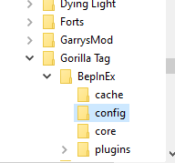
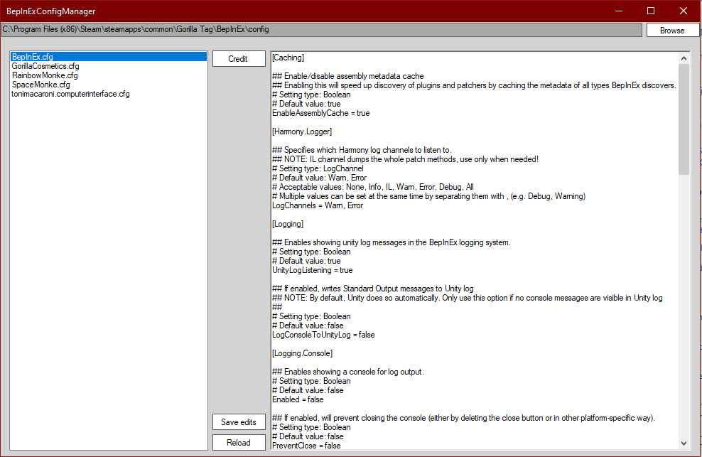

# BepInExConfigManager
One place app to configure BepInEx config files

Everything required is a one time setup and a savedPaths folder in the same directory as the exe

# INSTALL

This is how the install folder should look right now. Don't change it

In the top you will see a file path. If you dont see it and it says something like in the picture, you just need to set it up

You don't have to use the browse button, you can also just paste the path in the Saved_path.txt file

If you do use the browse button you will have to find the game with the BepInEx folder you want to link the app to. This can be changed later

At last you should be able to hit reload and see all the .cfg files and configure them from the app

If anything doesn't work DM me on JJoe#4865 on Discord
